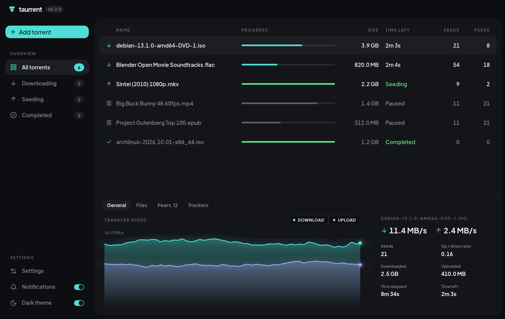
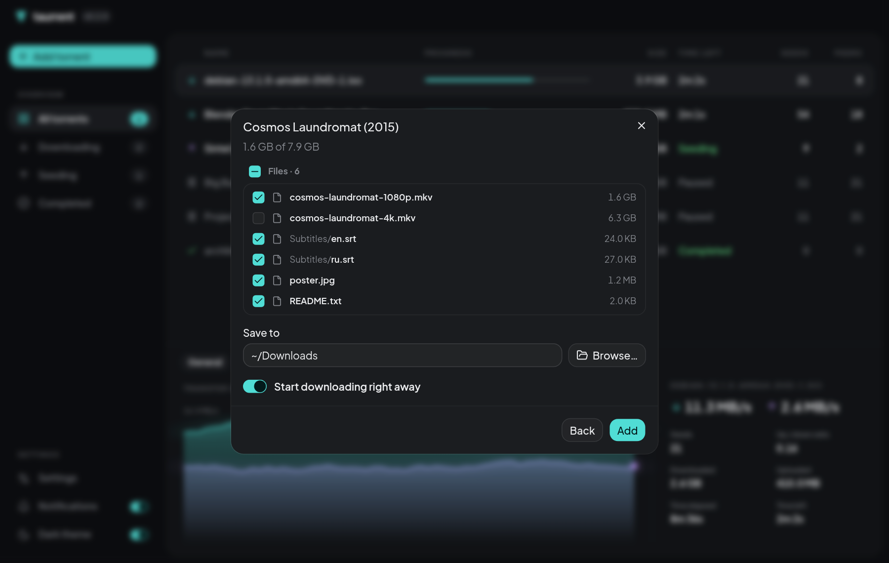
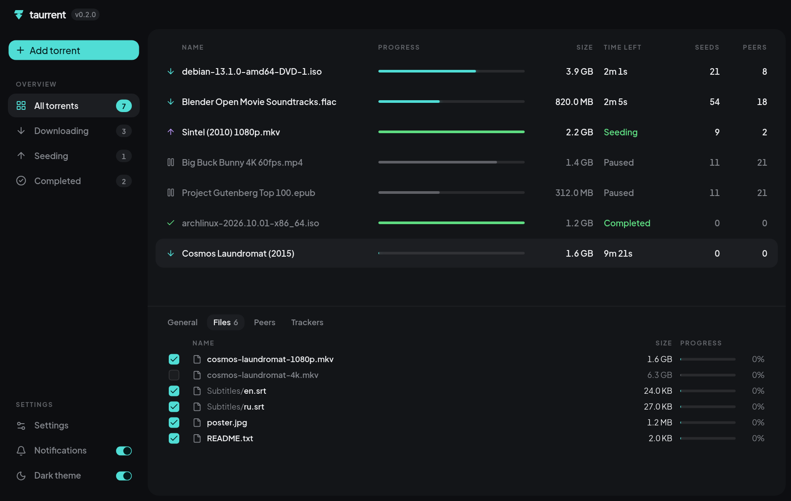
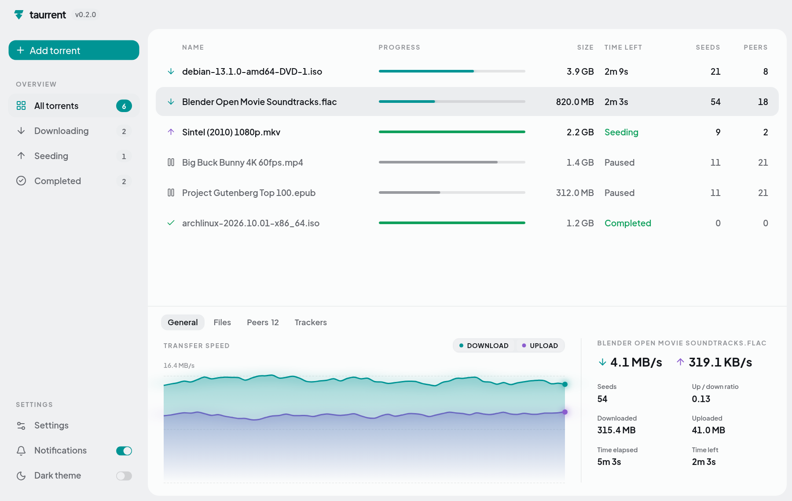

  <picture>
    <source media="(prefers-color-scheme: dark)" srcset="assets/brand/logo-dark.svg">
    
  </picture>

  Быстрый и лёгкий торрент-клиент для Linux и Windows.
   
  <a href="https://github.com/1rowvy/taurrent/releases/latest"><b>Скачать</b></a>
  ·
  <a href="README.md">English</a>

  

## Возможности

- **Добавление как удобно:** вставьте magnet-ссылку, откройте `.torrent`-файл, перетащите файлы в окно или нажмите на magnet-ссылку в браузере. Magnet-ссылка из буфера обмена подставляется сама.
- **Выбор до начала загрузки:** сначала видно содержимое торрента. Можно отметить только нужные файлы, выбрать папку и начать сразу или позже.
- **Всё на виду:** график скорости загрузки и отдачи, прогресс, оставшееся время, сиды и пиры. Сортировка по любой колонке, выбор нескольких торрентов через Ctrl/Shift и действия сразу над всеми.
- **Подробности по каждому торренту:** прогресс по файлам (набор файлов можно менять прямо во время загрузки), подключённые пиры, трекеры. Папку или файл можно открыть одним кликом.
- **Ограничение скорости** применяется сразу. Также настраиваются порт, UPnP, DHT и лимит пиров.
- **Не мешает:** работает в трее, сообщает о завершении загрузки и всё помнит между перезапусками.
- **Обновляется сам:** о новой версии приложение скажет и установит её в один клик.
- Светлая и тёмная тема, интерфейс на русском и английском.

  
  

## Скачать

Последняя версия — на [странице релизов](https://github.com/1rowvy/taurrent/releases/latest).

| Система | Файл |
|---|---|
| Windows 10 / 11 | `Taurrent_x.y.z_x64-setup.exe` (рекомендуется) или `.msi` |
| Debian, Ubuntu, Mint | `Taurrent_x.y.z_amd64.deb` |
| Fedora, openSUSE | `Taurrent-x.y.z-1.x86_64.rpm` |
| Другие Linux | `Taurrent_x.y.z_amd64.AppImage` |

Пока поддерживаются только 64-битные x86-системы.

### Об установке

- **Windows:** установщик пока не подписан, поэтому SmartScreen может предупредить о неизвестном издателе. Нажмите **Подробнее → Выполнить в любом случае**.
- **AppImage:** сделайте файл исполняемым (`chmod +x Taurrent_*.AppImage`) и запустите. При первом запуске он сам зарегистрируется как обработчик magnet-ссылок.
- **Значок в трее на Linux:** нужно окружение с системным треем (KDE, Cinnamon, XFCE и т. п.). В GNOME установите [расширение AppIndicator](https://extensions.gnome.org/extension/615/appindicator-support/). Без трея закрытие окна завершает приложение.
- Установщики `.deb`, `.rpm` и Windows регистрируют Taurrent как приложение для `.torrent`-файлов и `magnet:`-ссылок. Если по умолчанию уже выбран другой клиент, выберите Taurrent в системных настройках приложений по умолчанию.

## Советы

- **Ctrl+A** выделяет все торренты, **Esc** снимает выделение, стрелки перемещают его. Правый клик действует на все выбранные.
- Двойной клик по файлу на вкладке **Файлы** открывает его, правый клик — показывает в папке.
- Порт, UPnP, DHT и лимит пиров применяются после перезапуска. Когда он нужен, в настройках появляется кнопка **Перезапустить**.
- Если включено «Оставаться в трее при закрытии окна», полностью выйти можно через **Выход** в меню трея.

  

## Как устроен

Taurrent написан на [Tauri 2](https://tauri.app) и React, а торренты качает [librqbit](https://github.com/ikatson/rqbit) — движок на Rust. Он быстро запускается, потребляет мало памяти и не требует установки дополнительных сред.

Ошибки и идеи — в [Issues](https://github.com/1rowvy/taurrent/issues). Как собрать самому — в [docs/DEVELOPMENT.md](docs/DEVELOPMENT.md), план — в [docs/ROADMAP.md](docs/ROADMAP.md).
